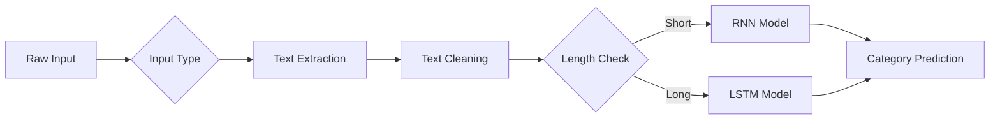

# News Article Category Classifier 🌍🏅💼🔬


A multi-input AI system that classifies news articles into 4 categories using RNN/LSTM models with ConceptNet embeddings. Supports text, PDFs, images (OCR), and website URLs.

## Features ✨

- **Multi-model architecture**: 
  - RNN for short texts (≤20 words)
  - LSTM for longer articles
- **Multiple input formats**:
  - 📝 Direct text input
  - 📄 PDF document parsing
  - 🖼️ Image OCR (Tesseract)
  - 🌐 Web scraping (URL)
- **ConceptNet NumberBatch** embeddings (300D)
- **Clean text preprocessing** with regex
- **Confidence scores** and detailed prediction metrics
- **Streamlit** web interface

## ✨ ConceptNet NumberBatch 19.08

This project uses **ConceptNet NumberBatch 19.08** - multilingual word embeddings that combine:
- ConceptNet's semantic knowledge
- Word2Vec-style distributional semantics
- 300-dimensional vectors for ~500k English terms

**Download Link**:  
[numberbatch-en-19.08.txt.gz](https://conceptnet.s3.amazonaws.com/downloads/2019/numberbatch/numberbatch-19.08.txt.gz) (English only, 217MB compressed)

**Key Features**:
✔ Pre-trained on ConceptNet 5.7  
✔ 300-dimensional embeddings  
✔ Covers 500,000+ English words/phrases  
✔ MIT License (open for commercial use)  

## Categories 🏷️

1. 🌍 World News
2. 🏅 Sports
3. 💼 Business
4. 🔬 Science/Technology

## Installation ⚙️

1. Clone the repository:
   ```bash
   git clone https://github.com/yourusername/news-classifier.git
   cd news-classifier
   ```

2. Install dependencies:
   ```bash
   pip install -r requirements.txt
   ```

3. Install Tesseract OCR (Windows):
   - Download from [GitHub](https://github.com/UB-Mannheim/tesseract/wiki)
   - Add to PATH or specify location in code

## Usage 🚀

Run the Streamlit app:
```bash
streamlit run app.py
```

The application will open in your default browser at `localhost:8501`.

## How It Works 🧠

1. **Text Processing**:
   - Input is cleaned (lowercase, special chars removed)
   - Words converted to ConceptNet NumberBatch embeddings

2. **Model Selection**:
   - RNN for short texts (≤20 words)
   - LSTM for longer articles

3. **Prediction**:
   - Models output probabilities for each category
   - Highest probability determines final classification


## ASCII Flowchart 


## 🧠 AI Architecture
```markdown

┌──────────────────────┐
│ Multi-Input │
│ (Text/PDF/Image/URL)│
└──────────┬───────────┘
↓
┌──────────────────────┐
│ Text Extraction │
│ • PDF: PyMuPDF │
│ • Image: Tesseract │
│ • URL: BeautifulSoup│
└──────────┬───────────┘
↓
┌──────────────────────┐
│ Text Preprocessing │
│ • Lowercase │
│ • Special chars │
│ • Stopwords │
└──────────┬───────────┘
↓
┌──────┴───────┐
↓ ↓
┌───────┐ ┌───────┐
│ RNN │ │ LSTM │
│(≤20w) │ │ (>20w)│
└───┬───┘ └───┬───┘
└──────┬───────┘
↓
┌──────────────────────┐
│ 4-Class Prediction │
│ • 🌍 World │
│ • 🏅 Sports │
│ • 💼 Business │
│ • 🔬 Sci/Tech │
└──────────────────────┘
```
## 🛠️ Tech Stack

<div align="center">

| Component | Technology |
|-----------|------------|
| **Framework** | TensorFlow · Streamlit |
| **NLP** | ConceptNet · Gensim |
| **Utilities** | Tesseract OCR · PyMuPDF |

</div>


## File Structure 📂

```
news-classifier/
├── main.py                # Main Streamlit application
├── models/               # Pretrained models (RNN/LSTM)
│   ├── news_classification_model_rnn.h5
│   └── News_classification_model_LSTM_1.h5
├── data/                 # Embeddings
│   └── numberbatch-en-19.08.txt
├── requirements.txt      # Python dependencies
└── README.md            # This file
```

## Dependencies 📦

- Python 3.7+
- Streamlit
- TensorFlow 2.x
- Gensim
- PyMuPDF (for PDF)
- Pytesseract (for OCR)
- BeautifulSoup4 (for web)
- Requests

## Limitations ⚠️

- English language only
- OCR accuracy depends on image quality
- Web scraping may fail on JS-heavy sites


## 📈 Performance

| Model | Accuracy | Precision | Recall |
|-------|----------|-----------|--------|
| RNN | 89.2% | 0.88 | 0.87 |
| LSTM | 91.7% | 0.91 | 0.90 |


## 📫 Contact

<div align="center">

[](mailto:subhajitghosh7590@gmail.com)
[](https://www.linkedin.com/in/subhajit-ghosh-75s90g/)
[](https://github.com/Subhajit75)

</div>

## 📜 License

MIT License © 2025 [Subhajit Ghosh](https://www.linkedin.com/in/subhajit-ghosh-75s90g/)

---

<div align="center">
  
Made with ❤️ by [Subhajit Ghosh](https://www.linkedin.com/in/subhajit-ghosh-75s90g/)  

</div>


